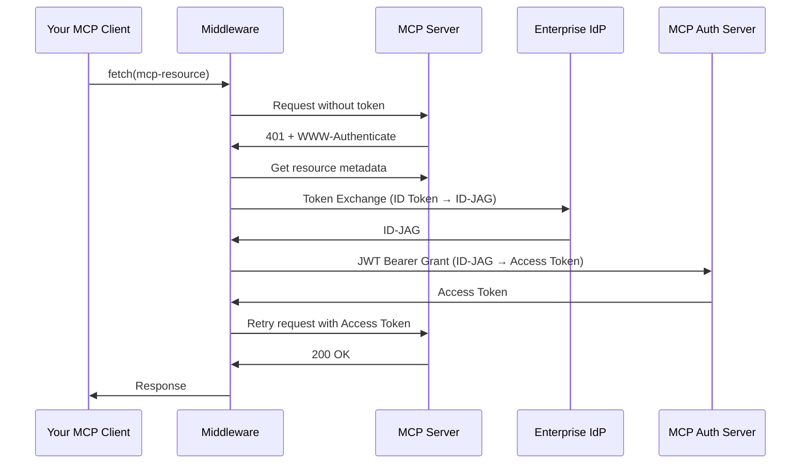

# Cross-App Access Middleware for MCP

A TypeScript fetch middleware that implements **Enterprise-Managed Authorization** for the Model Context Protocol (MCP).

This middleware automatically handles the OAuth 2.0 token flows required for cross-app access in enterprise environments, transparently managing authentication when your MCP client communicates with MCP servers.

## Overview

This implementation is based on the [Enterprise-Managed Authorization specification](../../../specification/draft/enterprise-managed-authorization.mdx) and provides:

- **Automatic 401 handling**: Intercepts unauthorized responses and automatically acquires tokens
- **Token exchange flow**: Exchanges ID Tokens from your enterprise IdP for ID-JAG (Identity Assertion JWT Authorization Grant)
- **JWT bearer grant**: Exchanges ID-JAG for MCP server access tokens
- **Token caching**: Caches access tokens to minimize round trips
- **Type-safe**: Full TypeScript support with comprehensive type definitions

## How It Works



## Installation

```bash
npm install @modelcontextprotocol/cross-app-access-middleware
```

## Quick Start

### Basic Usage

```typescript
import { createCrossAppAccessFetch } from '@modelcontextprotocol/cross-app-access-middleware';

// Configure the middleware
const authenticatedFetch = createCrossAppAccessFetch({
  // Your enterprise IdP configuration
  idpIssuerUrl: 'https://idp.example.com',
  idpClientId: 'your-client-id',
  idpClientSecret: 'your-client-secret',

  // MCP Server configuration
  mcpClientId: 'mcp-client-id',
  mcpClientSecret: 'mcp-client-secret',

  // Provide the ID Token from your SSO login
  getIdToken: async () => {
    // Return the ID Token you received from your enterprise IdP
    // This is typically stored after the user logs in
    return localStorage.getItem('id_token') || '';
  },
});

// Use it like regular fetch
const response = await authenticatedFetch('https://mcp.example.com/api/tools');
const data = await response.json();
```

### Advanced Usage with Token Caching

```typescript
import { CrossAppAccessMiddleware } from '@modelcontextprotocol/cross-app-access-middleware';

class TokenManager {
  private tokens = new Map<string, string>();

  async getIdToken(): Promise<string> {
    // Retrieve ID Token from secure storage
    return this.tokens.get('id_token') || '';
  }

  async getCachedAccessToken(resourceUrl: string): Promise<string | null> {
    // Check if we have a cached access token for this resource
    return this.tokens.get(`access_token:${resourceUrl}`) || null;
  }

  async onAccessTokenReceived(resourceUrl: string, token: string): Promise<void> {
    // Store the access token securely
    this.tokens.set(`access_token:${resourceUrl}`, token);
  }
}

const tokenManager = new TokenManager();

const middleware = new CrossAppAccessMiddleware({
  idpIssuerUrl: 'https://idp.example.com',
  idpClientId: 'your-client-id',
  idpClientSecret: 'your-client-secret',
  mcpClientId: 'mcp-client-id',
  mcpClientSecret: 'mcp-client-secret',

  getIdToken: () => tokenManager.getIdToken(),
  getCachedAccessToken: (resourceUrl) => tokenManager.getCachedAccessToken(resourceUrl),
  onAccessTokenReceived: async (tokenResponse) => {
    // Extract resource URL from somewhere in your app context
    const resourceUrl = 'https://mcp.example.com';
    await tokenManager.onAccessTokenReceived(resourceUrl, tokenResponse.access_token);
  },
});

// Use the middleware
const response = await middleware.fetch('https://mcp.example.com/api/resources');
```

### Integration with Existing MCP Client

```typescript
import { createCrossAppAccessFetch } from '@modelcontextprotocol/cross-app-access-middleware';
import { MCPClient } from '@modelcontextprotocol/sdk';

// Create authenticated fetch
const authenticatedFetch = createCrossAppAccessFetch({
  idpIssuerUrl: process.env.IDP_ISSUER_URL!,
  idpClientId: process.env.IDP_CLIENT_ID!,
  idpClientSecret: process.env.IDP_CLIENT_SECRET!,
  mcpClientId: process.env.MCP_CLIENT_ID!,
  mcpClientSecret: process.env.MCP_CLIENT_SECRET!,
  getIdToken: async () => {
    // Your logic to get the current user's ID Token
    return getCurrentUserIdToken();
  },
});

// Use with MCP SDK (if it supports custom fetch)
const client = new MCPClient({
  serverUrl: 'https://mcp.example.com',
  fetch: authenticatedFetch,
});

// All MCP operations will now automatically handle authentication
const tools = await client.listTools();
```

## Configuration Options

### `CrossAppAccessConfig`

| Option | Type | Required | Description |
|--------|------|----------|-------------|
| `getIdToken` | `() => Promise<string>` | Yes | Function that returns the current user's ID Token from your enterprise IdP |
| `idpIssuerUrl` | `string` | Yes | The issuer URL of your enterprise Identity Provider |
| `idpClientId` | `string` | Yes | Client ID registered with your IdP |
| `idpClientSecret` | `string` | No | Client secret for IdP authentication (if required) |
| `mcpClientId` | `string` | Yes | Client ID registered with the MCP Server's authorization server |
| `mcpClientSecret` | `string` | No | Client secret for MCP Server authentication (if required) |
| `fetch` | `typeof fetch` | No | Custom fetch implementation (defaults to global fetch) |
| `onAccessTokenReceived` | `(token: AccessTokenResponse) => void \| Promise<void>` | No | Callback when an access token is received (for caching) |
| `getCachedAccessToken` | `(resourceUrl: string) => Promise<string \| null>` | No | Function to retrieve cached access token for a resource |

## API Reference

### `createCrossAppAccessFetch(config)`

Creates a fetch function with cross-app access middleware applied.

**Parameters:**
- `config: CrossAppAccessConfig` - Middleware configuration

**Returns:**
- `typeof fetch` - Enhanced fetch function

**Example:**
```typescript
const authenticatedFetch = createCrossAppAccessFetch({
  // ... config
});

const response = await authenticatedFetch('https://mcp.example.com/api');
```

### `CrossAppAccessMiddleware`

Main middleware class for advanced usage.

**Constructor:**
```typescript
new CrossAppAccessMiddleware(config: CrossAppAccessConfig)
```

**Methods:**

#### `fetch(input, init?)`

Fetch wrapper that handles 401 responses with cross-app access flow.

```typescript
async fetch(input: RequestInfo | URL, init?: RequestInit): Promise<Response>
```

#### `clearTokenCache()`

Clear all cached tokens.

```typescript
middleware.clearTokenCache();
```

#### `clearTokenForResource(resourceUrl)`

Clear cached token for a specific resource.

```typescript
middleware.clearTokenForResource('https://mcp.example.com');
```

## How the Flow Works

The middleware implements the following flow when it encounters a 401 response:

1. **Initial Request**: Makes the request without authentication
2. **401 Response**: Receives 401 with `WWW-Authenticate` header containing `resource_metadata` URL
3. **Metadata Discovery**: Fetches the protected resource metadata to discover authorization servers
4. **Authorization Server Discovery**: Discovers the authorization server's endpoints
5. **Token Exchange**: Exchanges the ID Token for an ID-JAG (Identity Assertion JWT Authorization Grant)
   - Sends request to IdP's token endpoint
   - Receives ID-JAG that's scoped to the target MCP server
6. **JWT Bearer Grant**: Exchanges the ID-JAG for an access token
   - Sends ID-JAG to MCP Server's authorization server
   - Receives access token for the MCP server
7. **Retry Request**: Retries the original request with the access token
8. **Success**: Returns the successful response

## Token Caching

The middleware includes built-in token caching to minimize round trips:

- Tokens are cached in memory by default
- Tokens are automatically refreshed when they expire
- You can provide custom caching logic via `getCachedAccessToken` and `onAccessTokenReceived`
- Use `clearTokenCache()` to manually clear all cached tokens

## Error Handling

The middleware will throw errors in the following cases:

- Missing `WWW-Authenticate` header or `resource_metadata` URL
- Failed to fetch protected resource metadata
- Failed to discover authorization server metadata
- Token exchange failures
- JWT bearer grant failures
- Network errors

All errors include descriptive messages from the OAuth error responses when available.

## Security Considerations

1. **ID Token Security**: The ID Token should be stored securely and only accessible to your application
2. **Client Secrets**: Never expose client secrets in client-side code
3. **HTTPS Only**: Always use HTTPS for all endpoints
4. **Token Storage**: Store access tokens securely and clear them on logout
5. **Token Expiration**: The middleware respects token expiration and automatically refreshes

## Examples

See the [examples directory](./examples) for complete working examples:

- [Basic Example](./examples/basic.ts) - Simple usage with hardcoded configuration
- [Web App Example](./examples/web-app.ts) - Integration with a web application
- [Node.js Example](./examples/node.ts) - Server-side usage

## Specification

This implementation is based on:

- [Enterprise-Managed Authorization](../../../specification/draft/enterprise-managed-authorization.mdx)
- [RFC 8693 - OAuth 2.0 Token Exchange](https://datatracker.ietf.org/doc/html/rfc8693)
- [RFC 7523 - JWT Authorization Grant](https://datatracker.ietf.org/doc/html/rfc7523)
- [RFC 9728 - OAuth 2.0 Protected Resource Metadata](https://datatracker.ietf.org/doc/html/rfc9728)

## License

MIT

## Contributing

Contributions are welcome! Please see the [contributing guidelines](../../../CONTRIBUTING.md) for more information.
