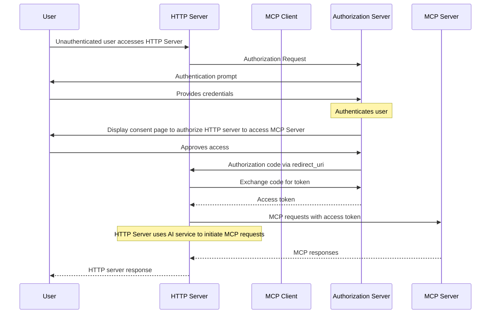

<Info>**Protocol Revision**: draft</Info>

## Introduction

### Purpose and Scope

The Model Context Protocol provides baseline authorization capabilities at the transport level in the main [Authorization specification](../basic/authorization.mdx), enabling MCP clients to make requests to protected MCP servers on behalf of resource owners.

The main [Authorization specification](../basic/authorization.mdx) requirements apply primarily to MCP client hosts that can import one or more protected MCP servers. Examples of such MCP client hosts include AI assistants implemented as web-based single-page applications (SPAs) and command-line interfaces (CLIs). To obtain a resource owner's approval, such an MCP client host requires a separate OAuth login for every imported protected MCP server.

An HTTP server application that requires an OAuth login and uses an AI service that depends on MCP to complete the current request acts as an MCP client server host. It can only support an application-specific OAuth login, rather than the multiple MCP Server specific OAuth logins supported by the main [Authorization specification](../basic/authorization.mdx).

This extension defines OAuth 2.1 Authorization Code flow support for MCP client server hosts, enabling HTTP-based servers that require an OAuth login to access protected MCP servers on behalf of resource owners.

### Extension Requirements

This extension is **RECOMMENDED** for MCP client server host implementations that use MCP HTTP-based transports.
When adopted:

- Implementations **MUST** conform to all requirements specified in this
  extension
- Implementations **MUST** also conform to the baseline authorization
  requirements that apply to MCP servers
- This extension is specifically designed for MCP client server host
  implementations that use MCP HTTP-based transports

### Standards Compliance

This extension is based on the following established specifications:

- OAuth 2.1 IETF DRAFT
  ([draft-ietf-oauth-v2-1-13](https://datatracker.ietf.org/doc/html/draft-ietf-oauth-v2-1-13))
- OAuth 2.0 Protected Resource Metadata
  ([RFC9728](https://datatracker.ietf.org/doc/html/rfc9728))
​
## Roles

A protected MCP server acts as an OAuth 2.1 resource server, capable of accepting and responding to protected resource requests using access tokens.

An HTTP server acts as an OAuth 2.1 client, making protected resource requests on behalf of a resource owner. HTTP servers are well suited for acting as confidential OAuth 2.1 clients that can securely store sensitive OAuth credentials such as client secrets and authorization code flow tokens.

In this extension, an MCP client does not act as an OAuth 2.1 client. Instead, the HTTP server that acts as an OAuth 2.1 client uses the MCP client to access a protected MCP server with access tokens on behalf of the resource owner.

The authorization server is responsible for authenticating HTTP server users and issuing access tokens for use at the MCP server.

## Overview

In this extension, the authorization flow requires pre-registered client credentials, which are typically established out-of-band through administrative channels.

Protected MCP servers MUST meet the baseline requirements specified in the main [Authorization specification](../basic/authorization.mdx).

Authorization servers MUST meet the implementation and metadata discovery requirements specified in the main [Authorization specification](../basic/authorization.mdx).

The authorization server that controls the OAuth login into an HTTP server and the authorization server associated with the protected MCP server that the HTTP server accesses with access tokens via MCP client on the user's behalf MUST be the same entity.

MCP clients MAY use OAuth 2.0 Protected Resource Metadata for authorization server discovery to reject access tokens before propagating them to MCP servers when it can be determined that the authorization server issuer and the access token issuer are different.

## Authorization Code Flow

### Flow Steps

The complete Authorization flow for MCP Client Server Host proceeds as follows:

## Resource owner consent

### Resource parameter

In this extension, the HTTP server acts as an OAuth 2.1 client. It MUST follow the Resource Parameter Implementation requirements specified in the main [Authorization specification](../basic/authorization.mdx) to request resource owner authorization for accessing protected MCP servers.

## MCP Client

An HTTP server that requires an OAuth login MUST make access tokens available to its MCP clients.

An MCP client MUST forward access tokens provided by its HTTP server host to the protected MCP server using the HTTP Authorization Bearer scheme as specified in the main [Authorization specification](../basic/authorization.mdx).

## MCP Server

Protected MCP servers MUST follow the baseline requirements specified in the main [Authorization specification](../basic/authorization.mdx).

## Security Considerations

Implementations adopting this extension **MUST** follow OAuth 2.1 security best
practices as laid out in
[OAuth 2.1 Section 7. "Security Considerations"](https://datatracker.ietf.org/doc/html/draft-ietf-oauth-v2-1-13#name-security-considerations),
with particular attention to:

- Client authentication security
- Token storage and handling
- Communication security requirements
- Client credential protection

