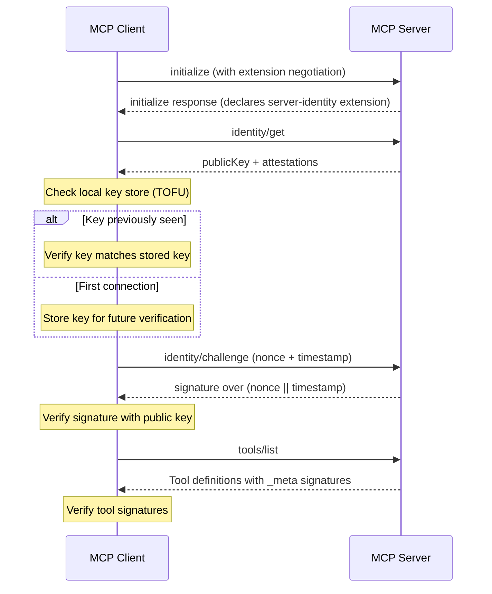

<Info>**Protocol Revision**: draft</Info>

## 1. Introduction

### 1.1 Purpose and Scope

This document defines an extension for cryptographic server identity and tool attestation in the Model Context Protocol (MCP). It provides mechanisms for MCP servers to present verifiable identities using Ed25519 key pairs, sign tool definitions to prove provenance, and allow clients to verify server identity via challenge-response.

MCP authorization extensions ([Client Credentials](./oauth-client-credentials.mdx), [Enterprise-Managed Authorization](./enterprise-managed-authorization.mdx)) address client-to-server authorization: proving a client is allowed to access server resources. This extension addresses the complementary problem of server-to-client identity: proving a server is who it claims to be.

This extension is:

- **Optional** — Servers that do not implement it are unaffected. Clients that do not support it ignore the identity metadata.
- **Additive** — All new fields, methods, and metadata are additions to the protocol. No existing behavior is modified.
- **Composable** — This extension works alongside existing OAuth authorization mechanisms without conflicts.

### 1.2 Motivation

MCP currently has no mechanism for a client to verify the identity of a server it connects to, nor can a client verify that tool definitions have not been tampered with in transit or at rest. This creates several security gaps identified in the [OWASP MCP Top 10](https://owasp.org/www-project-mcp-top-10/):

- **Server Impersonation (MCP09, MCP07).** An attacker can deploy an MCP server that claims to be a legitimate service but exfiltrates data or injects malicious instructions. Without cryptographic identity, the client cannot distinguish the real server from the impersonator.
- **Tool Definition Tampering (MCP03).** If an attacker modifies tool definitions (e.g., adding hidden parameters, altering descriptions to manipulate LLM behavior), the client cannot detect the change. [Invariant Labs disclosed tool poisoning attacks](https://invariantlabs.ai/blog/mcp-security-notification-tool-poisoning-attacks) where modified tool descriptions cause LLMs to exfiltrate sensitive data.
- **No Provenance Chain (MCP04).** When tools are distributed through registries or marketplace listings, there is no way to verify that a tool's definition matches what the original author published.
- **No Mutual Authentication.** MCP authorization focuses on client-to-server OAuth flows. There is no mechanism for a server to prove its identity to a client. [Tomasev et al.](https://arxiv.org/abs/2602.11865) discuss the need for transitive accountability via signed attestations in agent-to-agent delegation.

Server identity is most valuable for remote/network servers, marketplace-distributed servers, and multi-agent deployments where the client does not control the server lifecycle. For local servers launched by the client via stdio, the client already has implicit trust through process control.

### 1.3 Roles and Terminology

- **Server Identity**: An Ed25519 key pair where the public key serves as the server's verifiable identity.
- **Attestation**: A signed statement about a server's identity, issued by a specific party (the server itself, a publisher, or verified via DNS).
- **Tool Attestation**: A cryptographic signature over a tool's schema, binding the tool definition to the server's identity.
- **TOFU (Trust-On-First-Use)**: A trust model where the client records a server's key on first connection and detects changes on subsequent connections, similar to SSH `known_hosts`.
- **JWK (JSON Web Key)**: The key representation format defined in [RFC 7517](https://datatracker.ietf.org/doc/html/rfc7517).
- **JCS (JSON Canonicalization Scheme)**: The deterministic JSON serialization defined in [RFC 8785](https://datatracker.ietf.org/doc/html/rfc8785), used for constructing signature payloads.

### 1.4 Standards Compliance

This extension uses the following standards:

- [RFC 7517: JSON Web Key (JWK)](https://datatracker.ietf.org/doc/html/rfc7517) for key representation
- [RFC 8785: JSON Canonicalization Scheme (JCS)](https://datatracker.ietf.org/doc/html/rfc8785) for deterministic serialization of signature payloads
- [RFC 8032: Edwards-Curve Digital Signature Algorithm (EdDSA)](https://datatracker.ietf.org/doc/html/rfc8032) for Ed25519 signatures

## 2. Extension Declaration

Servers that support this extension **MUST** declare it in the `initialize` response using the MCP extensions capability:

```json
{
  "protocolVersion": "YYYY-MM-DD",
  "capabilities": {
    "extensions": {
      "io.modelcontextprotocol/server-identity": {
        "version": "1.0.0"
      }
    }
  },
  "serverInfo": {
    "name": "example-server",
    "version": "1.0.0"
  }
}
```

Clients that negotiate this extension can then retrieve identity metadata and verify tool attestations as described in this document.

## 3. Server Identity

### 3.1 Key Pair

Each MCP server that implements this extension **MUST** generate and maintain an Ed25519 key pair. The public key serves as the server's identity.

Key representation uses JWK format ([RFC 7517](https://datatracker.ietf.org/doc/html/rfc7517)):

```json
{
  "kty": "OKP",
  "crv": "Ed25519",
  "x": "<base64url-encoded 32-byte public key>",
  "kid": "<unique key identifier>",
  "use": "sig"
}
```

The Key ID (`kid`) **MUST** be a stable, unique identifier for the key. Implementations **SHOULD** derive the `kid` from the public key material (e.g., base64url-encoded SHA-256 hash of the raw public key, truncated to 16 bytes) to ensure reproducibility.

### 3.2 Identity Metadata

The server provides identity metadata via the `identity/get` method (see Section 5). The metadata structure:

```json
{
  "publicKey": {
    "kty": "OKP",
    "crv": "Ed25519",
    "x": "lhxR4x4bHk1gVz7XJdh0WuCGnt0bJq6BsJxpx7Vmq3g",
    "kid": "srv-a1b2c3d4e5f6g7h8"
  },
  "attestations": [
    {
      "type": "self",
      "signedAt": "2026-02-17T00:00:00Z",
      "signature": "<base64url-encoded Ed25519 signature over canonical identity>"
    }
  ]
}
```

### 3.3 Attestation Types

Attestations provide evidence about the server's identity. Each attestation is a signed statement from a specific party.

| Type        | Description                              | Signer                   | Security Value                                                                            |
| ----------- | ---------------------------------------- | ------------------------ | ----------------------------------------------------------------------------------------- |
| `self`      | Server signs its own public key metadata | Server's own Ed25519 key | Enables key pinning; proves key possession. Does NOT prove real-world identity on its own. |
| `publisher` | Organization that published the server   | Publisher's Ed25519 key  | Proves the server was signed by a known publisher.                                        |
| `dns`       | DNS TXT record confirms domain ownership | Verified via DNS lookup  | Binds server identity to a domain name.                                                   |

Self-attestation is **REQUIRED** for all servers implementing this extension. It enables clients to pin a server's key on first use (TOFU model). Other attestation types are **OPTIONAL** and provide stronger identity assurance.

Self-attestation canonical payload is the [RFC 8785](https://datatracker.ietf.org/doc/html/rfc8785) canonicalization of a JSON object containing exactly:

```json
{
  "type": "self",
  "publicKey": { "<the server's full JWK public key object>" : "..." },
  "signedAt": "<ISO 8601 timestamp>"
}
```

The server signs this canonical form with its own Ed25519 private key. Clients verify the self-attestation by reconstructing this object from the identity metadata and verifying the signature.

Publisher attestation structure:

```json
{
  "type": "publisher",
  "issuer": {
    "name": "Example Corp",
    "publicKey": {
      "kty": "OKP",
      "crv": "Ed25519",
      "x": "<publisher public key>",
      "kid": "pub-x1y2z3"
    },
    "url": "https://example.com"
  },
  "signedAt": "2026-02-17T00:00:00Z",
  "expiresAt": "2027-02-17T00:00:00Z",
  "signature": "<base64url-encoded signature over canonical attestation payload>"
}
```

Canonical attestation payload for signing is the JSON Canonicalization Scheme ([RFC 8785](https://datatracker.ietf.org/doc/html/rfc8785)) applied to the attestation object with the `signature` field excluded.

### 3.4 DNS Attestation

Servers **MAY** prove domain ownership via DNS TXT records. The record format:

```
_mcp-identity.example.com TXT "v=mcp1; kid=<key-id>; fp=<sha256-fingerprint>"
```

The `fp` value is the base64url-encoded (no padding) SHA-256 hash of the raw 32-byte Ed25519 public key.

Clients verifying DNS attestations **MUST**:

1. Extract the domain from the server's transport URL
2. Query the `_mcp-identity.<domain>` TXT record
3. Verify the `kid` matches the server's declared key ID
4. Compute `base64url(sha256(raw_public_key_bytes))` from the server's public key and verify it matches the `fp` value

> **Note:** DNS attestation is vulnerable to DNS spoofing unless DNSSEC is deployed. Clients **SHOULD** prefer DNSSEC-validated responses when available. DNS attestation alone provides weaker assurance than publisher attestation and **SHOULD** be used in combination with other attestation types for high-security deployments.

### 3.5 Key Revocation

Servers that need to revoke a compromised key **SHOULD**:

1. Generate a new key pair
2. Publish a revocation attestation signed by the old key (if still available) that references the new key's `kid`
3. Update DNS TXT records to reflect the new key

Clients **SHOULD** maintain a local key store (similar to SSH `known_hosts`). When a server presents a different key than previously seen, the client **SHOULD** warn the user and require explicit acceptance.

A revocation attestation has the following structure:

```json
{
  "type": "revocation",
  "revokedKid": "srv-old-key-id",
  "replacementKid": "srv-new-key-id",
  "reason": "key-compromise",
  "signedAt": "2026-02-17T00:00:00Z",
  "signature": "<base64url-encoded signature by the old key>"
}
```

> **Note:** A revocation attestation signed by the old key does not protect against key compromise — an attacker with the old key could create their own revocation pointing to a key they control. Revocation attestations are useful for planned key rotation, not emergency compromise response. For key compromise, revocation **MUST** be performed out-of-band: DNS TXT record update, publisher re-attestation with the new key, or registry-based revocation.

## 4. Tool Attestation

### 4.1 Signed Tool Definitions

Servers implementing this extension **SHOULD** sign tool definitions. The signature covers the tool schema, binding the tool's behavior contract to the server's identity.

When tool definitions are listed via `tools/list`, each tool **MAY** include identity metadata in the tool's `_meta` field:

```json
{
  "name": "query_database",
  "description": "Execute a read-only SQL query",
  "inputSchema": {
    "type": "object",
    "properties": {
      "sql": { "type": "string" }
    },
    "required": ["sql"]
  },
  "_meta": {
    "io.modelcontextprotocol/server-identity": {
      "signature": "<base64url-encoded Ed25519 signature>",
      "kid": "srv-a1b2c3d4e5f6g7h8",
      "signedAt": "2026-02-17T00:00:00Z"
    }
  }
}
```

Signature payload is computed by:

1. Extracting the tool's `name`, `description`, and `inputSchema` fields (these three fields **MUST** always be signed)
2. If the tool has `outputSchema`, it **MUST** also be included
3. Constructing a JSON object containing these fields
4. Canonicalizing the object using [RFC 8785](https://datatracker.ietf.org/doc/html/rfc8785)
5. Signing the canonical bytes with the server's Ed25519 private key

The set of signed fields is fixed (not configurable per tool) to prevent an attacker from selectively excluding fields from signing.

Clients **MAY** verify tool signatures to detect tampering. Clients that do not support this extension ignore `_meta` keys they do not recognize.

### 4.2 Tool Version Binding

When a server updates a tool definition, it **MUST** re-sign the tool. Clients that cache tool definitions **SHOULD** re-verify signatures when the `signedAt` timestamp changes.

## 5. Extension Methods

This extension defines the following JSON-RPC methods. Servers that declare this extension **MUST** implement these methods.

### 5.1 `identity/get`

Returns the server's identity metadata.

**Request:**

```json
{
  "jsonrpc": "2.0",
  "id": 1,
  "method": "identity/get",
  "params": {}
}
```

**Response:**

```json
{
  "jsonrpc": "2.0",
  "id": 1,
  "result": {
    "publicKey": {
      "kty": "OKP",
      "crv": "Ed25519",
      "x": "lhxR4x4bHk1gVz7XJdh0WuCGnt0bJq6BsJxpx7Vmq3g",
      "kid": "srv-a1b2c3d4e5f6g7h8"
    },
    "attestations": [
      {
        "type": "self",
        "signedAt": "2026-02-17T00:00:00Z",
        "signature": "<base64url-encoded signature>"
      }
    ]
  }
}
```

**Errors:**

| Code   | Message          | Description                              |
| ------ | ---------------- | ---------------------------------------- |
| -32601 | Method not found | Server does not implement this extension |

### 5.2 `identity/challenge`

Challenge-response protocol for verifying the server controls the declared private key.

**Request:**

```json
{
  "jsonrpc": "2.0",
  "id": 2,
  "method": "identity/challenge",
  "params": {
    "challenge": "<base64url-encoded 32-byte random nonce>",
    "timestamp": "2026-02-17T00:00:00Z"
  }
}
```

| Parameter   | Required/Optional | Description                                                          | Example/Allowed Values              |
| ----------- | ----------------- | -------------------------------------------------------------------- | ----------------------------------- |
| `challenge` | REQUIRED          | A base64url-encoded nonce of at least 32 cryptographically random bytes | `dGhpcyBpcyBhIHRlc3QgY2hhbGxlbmdl` |
| `timestamp` | REQUIRED          | ISO 8601 timestamp, **MUST** be within 5 minutes of server time      | `2026-02-17T00:00:00Z`              |

**Response:**

```json
{
  "jsonrpc": "2.0",
  "id": 2,
  "result": {
    "signature": "<base64url-encoded Ed25519 signature over (challenge || timestamp)>",
    "kid": "srv-a1b2c3d4e5f6g7h8"
  }
}
```

| Parameter   | Required/Optional | Description                                                            | Example/Allowed Values              |
| ----------- | ----------------- | ---------------------------------------------------------------------- | ----------------------------------- |
| `signature` | REQUIRED          | Ed25519 signature over the concatenation of challenge bytes and timestamp UTF-8 bytes | (base64url-encoded 64-byte signature) |
| `kid`       | REQUIRED          | Key ID of the signing key                                              | `srv-a1b2c3d4e5f6g7h8`             |

**Errors:**

| Code   | Message         | Description                                       |
| ------ | --------------- | ------------------------------------------------- |
| -32602 | Invalid params  | Challenge is malformed or too short               |
| -32001 | Stale timestamp | Timestamp is more than 5 minutes from server time |
| -32002 | Replayed nonce  | Challenge nonce has been seen before              |

**Verification procedure:**

1. Client generates 32 bytes of cryptographically random data and the current timestamp
2. Client sends `identity/challenge`
3. Server signs `(challenge_bytes || timestamp_utf8_bytes)` with its Ed25519 private key
4. Client verifies the signature using the public key from `identity/get`
5. If verification fails, the client **SHOULD** terminate the connection

The following sequence diagram illustrates the identity verification flow:



## 6. Security Considerations

### 6.1 Algorithm Selection

Ed25519 ([RFC 8032](https://datatracker.ietf.org/doc/html/rfc8032)) was selected for the following properties:

- 32-byte public keys and 64-byte signatures minimize metadata overhead
- Deterministic signatures eliminate implementation bugs related to random number generation
- ~128 bits of security, sufficient for current threat models
- Broad ecosystem support across all major programming languages

### 6.2 New Attack Surfaces

- **Key compromise**: If a server's private key is compromised, an attacker can impersonate it. Mitigation: key revocation (Section 3.5), short-lived attestations, key pinning alerts.
- **TOFU vulnerability window**: On first connection, the client has no prior key to compare against. An attacker who controls the network during first contact can present their own key. Mitigation: use publisher or DNS attestation for initial trust establishment.
- **DNS spoofing**: DNS attestation is vulnerable to spoofing without DNSSEC. Mitigation: clients **SHOULD** prefer DNSSEC-validated responses and combine DNS attestation with other attestation types.

### 6.3 Privacy Considerations

- Server public keys are stable identifiers that could be used to track servers across connections. Servers that require anonymity **SHOULD NOT** implement this extension.
- DNS attestation reveals the association between a domain and an MCP server identity.

### 6.4 Relationship to Authorization

This extension provides **identity** (who is this server?) but not **authorization** (what is this server allowed to do?). Authorization decisions remain the responsibility of the client and existing OAuth mechanisms defined in the [Client Credentials](./oauth-client-credentials.mdx) and [Enterprise-Managed Authorization](./enterprise-managed-authorization.mdx) extensions.

### 6.5 Data Validation

- Clients **MUST** validate that public keys are well-formed Ed25519 keys (32 bytes) before using them.
- Clients **MUST** validate that signatures are 64 bytes (Ed25519 signature size).
- Clients **MUST** reject expired attestations (where `expiresAt` is in the past).
- Clients **MUST** validate challenge freshness (timestamp within 5 minutes, nonce not reused).
